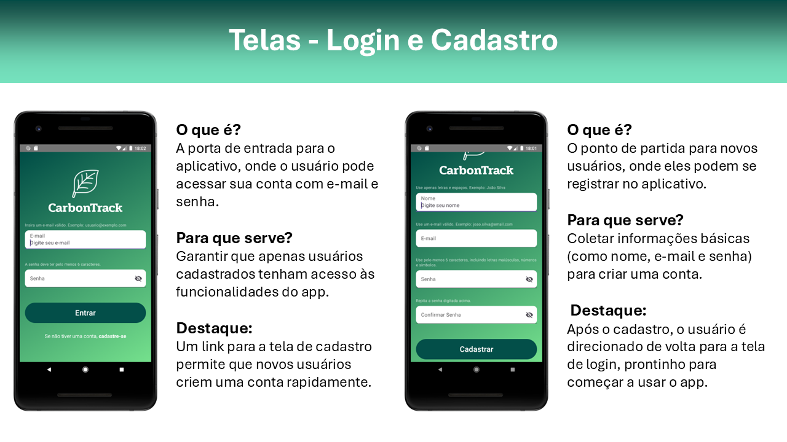
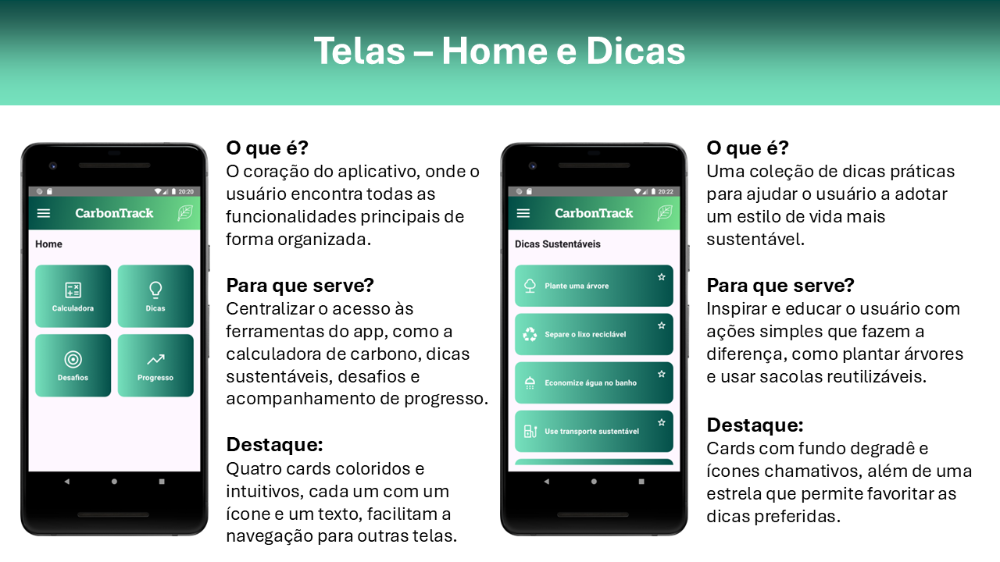
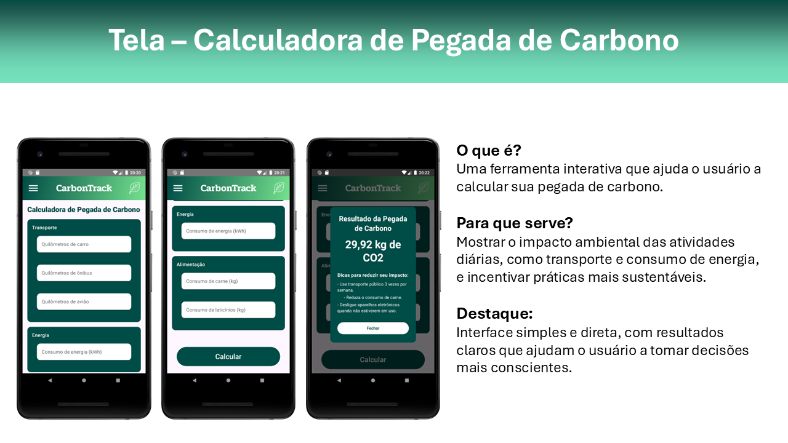
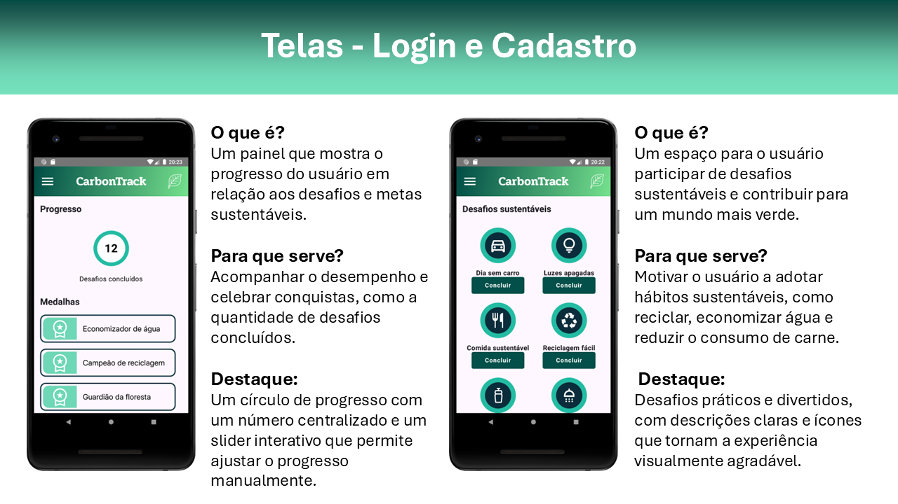

 <!-- Substitua pelo caminho real, se existir -->


# 🌱 CarbonTrack

**CarbonTrack** é um aplicativo Android desenvolvido em Kotlin que permite aos usuários monitorar sua pegada de carbono com base em atividades do dia a dia, promovendo maior consciência ambiental e incentivando ações sustentáveis.


---

## 📱 Funcionalidades

- 🔢 **Cálculo de emissões de CO₂** com base em transporte, consumo e hábitos diários
- 📊 **Visualização gráfica** da evolução da pegada de carbono
- 🧠 **Dicas personalizadas** para reduzir o impacto ambiental
- 📝 **Histórico de atividades** registradas
- 🌍 **Interface amigável e educativa**, voltada para usuários preocupados com sustentabilidade

---

## 🛠️ Tecnologias Utilizadas

- **Linguagem:** Kotlin  
- **Framework:** Android SDK + Jetpack  
- **Padrão de Arquitetura:** MVVM
- **Banco de dados:** SQLite  
- **Bibliotecas:** Retrofit, Room, Jetpack Navigation, Material Design  
- **API:** [Carbon Track API](https://github.com/D1MELLO/carbon_track_api) para cálculos de emissão (dados mockados)

---

## 📦 Instalação

Clone o repositório e abra no Android Studio:

```bash
git clone https://github.com/D1MELLO/CarbonTrack.git
```

1. Abra o projeto no Android Studio
2. Conecte um dispositivo/emulador Android
3. Execute a aplicação

---

## 📸 Capturas de Tela

<!-- Substitua os links pelos caminhos reais caso existam -->





---

## 🤝 Contribuição

Contribuições são bem-vindas! Se quiser sugerir melhorias ou corrigir algo, sinta-se livre para abrir uma issue ou enviar um pull request.

---

## 🪪 Licença

Distribuído sob a licença MIT. Veja o arquivo [LICENSE](LICENSE) para mais informações.

---

### Criado por [Sérgio de Melo](https://github.com/D1MELLO) & [Isabela Osaki](https://github.com/iosaki)
